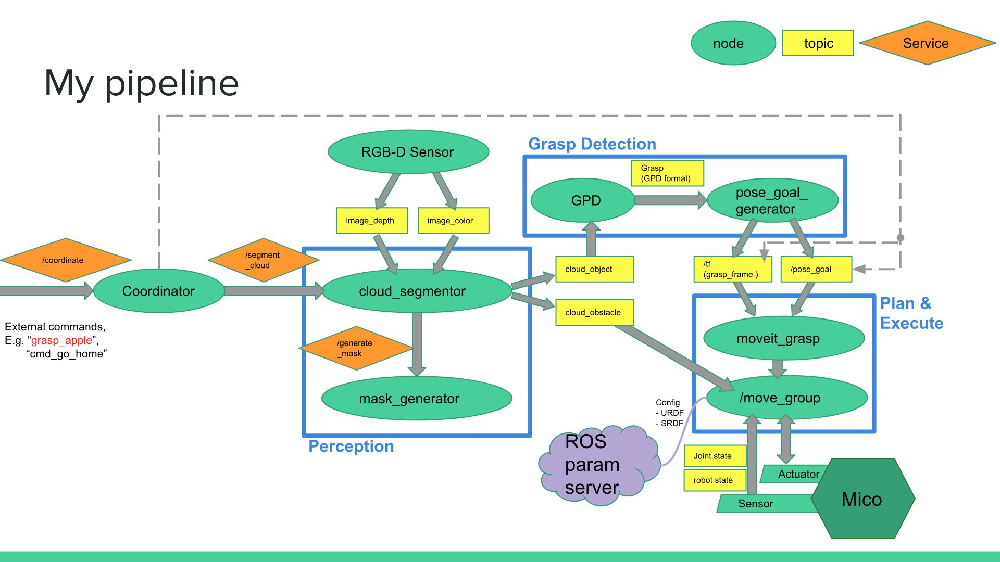

# unknown-pick

**End-to-end Solution for Robotic Manipulation of Unknown Objects**

Miaoding Dai
> Final Project in MSR, Northwestern University (Fall 2018); advised by [Argallab](http://www.argallab.northwestern.edu/).

Demo video can be found [here](https://youtu.be/AsTXIjYesws). Refer to my [project presentation](https://drive.google.com/file/d/1nkwlLNjLoMK-qR8m-gktYasgBhdgwJU_/view?usp=sharing) and [portfolio](https://mdai17.github.io/unknown_pick.html) for more details.

## Pipeline Flow

#### Overview

## Installation

#### Dependencie
